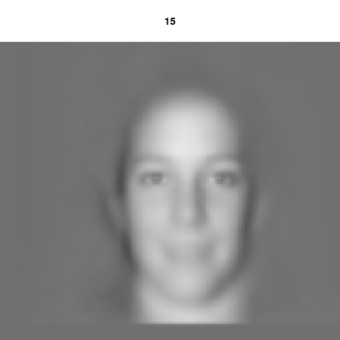

```{r required packages,message=FALSE,warning=FALSE}
source("eigenfaces.R")
library(plyr)
library(knitr)
library(kableExtra)
library(ggplot2)
library(ggfortify)
library(gridExtra)
library(factoextra)
library(caret)
```

# Introduction

### Face Data

The 1991 article *Eigenfaces for Recognition* was formative for the multimedia research fields [@Turk1991]. The MIT Faces Recognition Project database, which predates the *Eigenfaces for Recognition* article, has since become a benchmark for computer vision and machine learning.


The data consists of 3993 pictures of human faces at a resolution of 128 x 128 in 8-bit grayscale. Data can be obtained from [MIT](http://courses.media.mit.edu/2004fall/mas622j/04.projects/faces/).

### Objective

My objective was two-fold, a data science exploration of dimension reduction in the context of face images and a classification of an image metafeature such as gender using the image itself.

# Methods

## Data Import
The eigenface rawdata is packaged with this repository and can be loaded with the following code. Two pictures were remove from the rawdata as provided from MIT because they were of incorrect dimensions: 2416 and 2412. Moreover, 22 faces are removed for having no parsed information.

```{r data import, message=FALSE, warning=FALSE, include=TRUE}
source("eigenfaces.R")
dat<-importFaceMatrix()
```

Each picture is represented as vector of length $128^{2}=16,384$. This vector can be reshaped into a raster, which can be colored with a color scale — grayscale in our case. Three random faces have been generated below.

```{r plot images,fig.height=3,fig.width=9,collapse=TRUE,results= 'hold'}
#This code may be run multiple times to see the huge diversity of images in the data.
par(mfrow=c(1,3))
selected<-sample(rownames(dat),3)
{plotImage(dat[selected[1],],selected[1])
plotImage(dat[selected[2],],selected[2])
plotImage(dat[selected[3],],selected[3])}
```

## Metadata Import and Train/Test Set Splitting

The metadata comes from MIT already split into two sets, training and testing. However, there are compositional biases between the two sets. Therefore, the sets will be combined and split later using a true random split.

```{r meta import,message=FALSE,warning=FALSE,include=TRUE}
meta_TR<-importMetaMatrix("faces/faceDR")
meta_T<-importMetaMatrix("faces/faceDS")
meta_TR<-meta_TR[meta_TR$n %in% rownames(dat),] # Remove any examples from metadata that are not in the data.
meta_T<-meta_T[meta_T$n %in% rownames(dat),]
meta<-rbind(meta_TR,meta_T)
rownames(meta)<-meta$n
meta<-meta[rownames(dat),]
#rm(dat)
```

```{r train test split}
set.seed(1234)
trainIndex <- createDataPartition(meta$sex, p = .8, 
                                  list = FALSE, 
                                  times = 1)
meta_TR<-meta[trainIndex,]
meta_T<-meta[-trainIndex,]
dat_TR<-dat[trainIndex,]
dat_T<-dat[-trainIndex,]
```

The training set consists of `r nrow(dat_TR)` faces, and the test set consists `r nrow(dat_T)` observations. There are a handful of entries in the data that are not contained in the meta. And there are numerous images which do not contain any information. Both have been removed.

## Metadata EDA

```{r metadata barplot,echo=FALSE,fig.height=6,fig.width=9,fig.align='center'}
foo<-function() {p1<-qplot(sex,data=meta_TR)+ggtitle("Sex")+coord_flip()+theme_classic()
p2<-qplot(age,data=meta_TR)+ggtitle("Age")+coord_flip()+theme_classic()
p3<-qplot(race,data=meta_TR)+ggtitle("Race")+coord_flip()+theme_classic()
p4<-qplot(face,data=meta_TR)+ggtitle("Face")+coord_flip()+theme_classic()
p5<-qplot(prop,data=meta_TR)+ggtitle("Prop")+coord_flip()+theme_classic()
grid.arrange(p1,p2,p3,p4,p5,tableGrob(count(meta_TR[,2:3]),rows=NULL),ncol=3,top="Exploratory Data Analysis")}
foo()
```

### EDA Takeaways

Each of the available metadata fields are highly biased. Most pictures are of white, adult, male subjects. The two largest groups are adult females and adult males. Given that, I will only consider white adults. This significantly limits the scope of any successful classifiers based on this data; it would not be generalizable to the population at large.

## Average faces

The average face is computed by taking the average of each column across all of the training data. This vector is important for centering each pixel for subsequent decomposition.

```{r average face calc}
c_means = colMeans(dat_TR)
c_dat_TR<-scale(dat_TR, center = 1 * c_means, scale=FALSE)
```

```{r cmeans,echo=FALSE,,fig.height=3,fig.width=9}
par(mfrow=c(1,3))
foo<-function() {
  plotImage(c_means,"Average Face")
plotImage(colMeans(dat_TR[meta_TR[meta_TR$sex=="female",]$n,]),"Average Female Face")
plotImage(colMeans(dat_TR[meta_TR[meta_TR$sex=="male",]$n,]),"Average Male Face")}
foo()
```

The average faces reveal a few trends. Namely that the female face has less prominent ears; presumably because more female faces have long hair. Moreover, the eyes of the male face appear slightly less tilted, and the face appears slightly larger.

## SVD and Eigenfaces

```{r load svd,echo=FALSE}
# SVD calculation takes a long time
load(file.path("models","svd.Rdata"))
```

```{r SVD,eval=FALSE}
### REQUIRED ON FIRST RUN
c_means<-colMeans(dat_TR)
c_dat_TR<-scale(dat_TR, center = 1 * c_means, scale=FALSE) # Centers each pixel.
svd.res<-svd(c_dat_TR)
save(list = c("svd.res"),file = file.path("models","svd.Rdata"))
```


SVD is a decomposition method that is applicable for any matrix, and is defined by the following equation:

$$A=USV^T$$

In R, `svd()` produces `u`, which represents $U$; `d`. which is a vector for $S$; `v`, which represents $V^T$.

## SVD Dimension Reduction Results

The following graphics exhibit

```{r SVD diagnostics,fig.height=7,fig.width=10,echo=FALSE}
foo2<-function(d) {
  x<-data.frame(ith_Eig=1:d,
                Proportion = round(svd.res$d^2/sum(svd.res$d^2),3)[1:d],
                Cumulative = round(cumsum(svd.res$d^2)/sum(svd.res$d^2),3)[1:d])
  return(x)
}
x<-foo2(100)
p1<-ggplot(data=x[1:5,])+
  geom_line(aes(x=ith_Eig,y=Proportion),linetype='dashed')+
  geom_point(aes(x=ith_Eig,y=Proportion))+
  geom_label(aes(x=ith_Eig,y=Proportion,label=Proportion),nudge_x = .5,nudge_y = .005)+
  theme_classic()+ggtitle("Proportion of Variance Explained")
p2<-tableGrob(x[1:20,c(2,3)])
grid.arrange(p1,p2,ncol=2)
```

Eigenfaces are created from $V_{d,k}$ where $k$ is the number of desired eigenfaces. In R, this is simply `t(svd.res$v[,1:k])`, where each columns is an eigenvector.

```{r plot eigen faces,echo=FALSE}
par(mfrow = c(2, 5))
par(oma = rep(2, 4), mar = c(0, 0, 3, 0))
for(i in seq(1:10)) {
  plotImage(t(svd.res$v[,i]),paste0(i))
}
```

## Reconstruct Faces

SVD can be used to make low-rank approximations of points within the original matrix. In our case, we can reconstruct the original matrix using `r params$n_features` features, which is specified as a parameter in this document.

```{r Reconstruct Matrix}
S<-diag(svd.res$d)
Ss<-S[,1:params$n_features]
V<-svd.res$v[,1:params$n_features]
restr<-svd.res$u %*% Ss %*% t(V) # U * S * V^T
restr <- scale(restr, center = -1 * c_means, scale=FALSE)
```


These reconstructed faces can be plotted and compared to the original images.

```{r plot reconstructed faces,echo=FALSE}
par(mfrow = c( 2,4))
par(mar = c(0, 0, 3, 0
                             ))
for(i in sample(seq(nrow(dat_TR)),8)) {
  plotImage(dat_TR[i,],meta_TR[i,]$n)
  plotImage(restr[i,],paste0(meta_TR[i,]$n,"R"))
}
rm(restr)
```


Moreover, we can see how adding additional bases for a reconstruction iteratively improves the image quality.

```{r Reconstruct slow,eval=FALSE}
sel<-sample(1:nrow(dat_TR),size = 3)
for (nul in seq(1,70)) {
  if (nul < 10) {name = paste('000',nul,'plot.jpg',sep='')}
  if (nul < 100 && nul >= 10) {name = paste('00',nul,'plot.jpg', sep='')}
  if (nul >= 100) {name = paste('0', nul,'plot.jpg', sep='')}
i<-nul*1
Sss<-S[,1:i]
V<-svd.res$v[,1:i]
gx<-svd.res$u[sel,] %*% Sss %*% t(V) # U * S * V^T
gx <- scale(gx, center = -1 * c_means, scale=FALSE)
png(file.path("images","slow",name))
par()
plotImage(gx[1,],title = i)
dev.off()
}
sel<-sample(1:nrow(dat_TR),size = 3)
for (nul in seq(1,60)) {
  if (nul < 10) {name = paste('000',nul,'plot.jpg',sep='')}
  if (nul < 100 && nul >= 10) {name = paste('00',nul,'plot.jpg', sep='')}
  if (nul >= 100) {name = paste('0', nul,'plot.jpg', sep='')}
i<-nul*15
Sss<-S[,1:i]
V<-svd.res$v[,1:i]
gx<-svd.res$u[sel,] %*% Sss %*% t(V) # U * S * V^T
gx <- scale(gx, center = -1 * c_means, scale=FALSE)
png(file.path("images","fast",name))
par()
plotImage(gx[1,],title = i)
dev.off()
}
system("convert -delay 15 -loop 0 images/slow/*.jpg images/slow/c.gif")
system("convert -delay 15 -loop 0 images/fast/*.jpg images/fast/c.gif")
```




# ML with Caret

Max Kuhn's `caret` package offers a modular framework for the preparation and deployment of numerous ML models. The `caret` system is intuitive and well [documented](https://topepo.github.io/caret/index.html).

## NZV pre-processing

I have decided to use near-zero variance filtering to remove pixels with no or very little variance. I.e., pixels that are almost always black. All models deal with uninformative variables in some way--sometimes poorly. Removing them outright during pre-processing avoids that altogether while also reducing the computational burden. As per the `caret` documentation:

>NZV filtering removes features that satisfy either of the following two conditions:
1. the frequency of the most prevalent value over the second most frequent value (called the “frequency ratio’’), which would be near one for well-behaved predictors and very large for highly-unbalanced data.
2. the “percent of unique values’’ is the number of unique values divided by the total number of samples (times 100) that approaches zero as the granularity of the data increases.

I have modified the filtering to require only five percent of values to be unique, which translates into an allowance of nearly `r round(nrow(dat_TR)*.01)` permitted outliers. I imagine these as images which extend farther into the black space than most. The reasoning to do this is that some images feature larger hair or hat, which could be sparse, yet informative latent features.

```{r pre-processing data splitting,fig.height=6,fig.width=7}
sel_class<-"sex"
nzv<-nearZeroVar(dat_TR, uniqueCut = 5) # five percent of values must be unique
non_nzv<-seq(ncol(dat_TR))[-nzv]
i<-rep(255,128*128)
i[nzv]<-1
plotImage(i,"Pixels Filtered by NZV")

training<-data.frame(Class=meta_TR[[sel_class]],dat_TR[,-nzv])
test<-data.frame(Class=meta_T[[sel_class]],dat_T[,-nzv])
preProcValues <- preProcess(training, method = c("center"))
trainTransformed <- predict(preProcValues, training)
testTransformed<-predict(preProcValues, test)
```

After pre-processing, the transformed training data generates four models. More information about each model can be found in the `caret` documentation. I chose these models to cover a variety of types: boosted, regression, ensemble, decision tree/rule-based, and regression. This panel is not exhaustive by any means.

```{r model generation,eval=FALSE}
liftCtrl <- trainControl(method = "cv", classProbs = TRUE,
                     summaryFunction = twoClassSummary)
c5 <- train(Class ~ ., data = trainTransformed,
                 method = "C5.0", metric = "ROC",
                 tuneLength = 10,
                 trControl = liftCtrl,
                 control = C50::C5.0Control(earlyStopping = FALSE))
fda<- train(Class ~ ., data = trainTransformed,
                  method = "fda", metric = "ROC",
                  tuneLength = 20,
                  trControl = liftCtrl)
glmBoost_grid = expand.grid(mstop = c(50, 100, 150, 200, 250, 300),
                           prune = c('yes', 'no'))
glmboost<-train(Class~.,data=trainTransformed,
                method="glmboost",metric='ROC',
                trControl=liftCtrl,tuneGrid=glmBoost_grid)
XGB_grid <- expand.grid(nrounds=c(100,200,300,400), 
                         max_depth = c(3:7),
                         eta = c(0.05, 1),
                         gamma = c(0.01),
                         colsample_bytree = c(0.75),
                         subsample = c(0.50),
                         min_child_weight = c(0))
rf_fit <- train(Class ~., data = trainTransformed, method = "xgbTree",
                trControl=liftCtrl,
                tuneGrid = XGB_grid,
                tuneLength = 10,
                metric='ROC')
```

```{r get models,echo=FALSE,eval=TRUE}
# The models have been generated with the generateModels.R script.
load(file.path("models","sexliftcent_models.Rdata"))
```

### NZV-based Variable Importance Figures

The models are then analyzed through `varImp` in `caret`. The plots show both how different classifiers use different numbers of features and how the models *see* the data. Intuitively, some of the models picked up on important variance around the eyes and the peripheries of the head.

```{r model analysis,message=FALSE,echo=FALSE}
plotVarImp<-function(model,title=NULL) {
imp<-varImp(model,scale=TRUE)$importance
imp<-cbind(imp,i=as.numeric(stringr::str_remove(rownames(imp),"X")))
imp<-imp[order(imp$i),]
i<-rep(0,128*128)
i[non_nzv]<-imp$Overall
d <- matrix(i, nrow = sqrt(length(i)))
image(
    d[, nrow(d):1],
    col = viridis::viridis(500),
    axes = FALSE,
    main=paste0("varImp ",ifelse(is.null(title),yes = "",no = title)))
}
par(mfrow = c( 1,2))
par(mar = c(0, 0, 3, 0))
{plotVarImp(fda,title="FDA")
plotVarImp(glmboost,title="GLM Boost")
plotVarImp(rf_fit,title="XGBoost Tree")
plotVarImp(c5,title="C5.0")}
```

### NZV-based Lift Results and Plot

```{r lift results and plots}
lift_results <- data.frame(Class = testTransformed$Class)
lift_results$FDA <- predict(fda, testTransformed, type = "prob")[,"female"]
lift_results$XGB <- predict(rf_fit, testTransformed, type = "prob")[,"female"]
lift_results$C5.0 <- predict(c5, testTransformed, type = "prob")[,"female"]
lift_results$GLMB <- predict(glmboost, testTransformed, type = "prob")[,"female"]
lift_obj <- lift(Class ~ FDA + XGB + C5.0+GLMB, data = lift_results)
ggplot(lift_obj, values = 60)
```

### NZV-based Test Set Confusion Matrices

```{r confusion mats,echo=FALSE}
p_results<-data.frame(Class=test$Class)
p_results$FDA <- predict(fda, testTransformed)
p_results$XGB <- predict(rf_fit, testTransformed)
p_results$C5.0 <- predict(c5, testTransformed)
p_results$GLMB <- predict(glmboost, testTransformed)
cMat_FDA<-confusionMatrix(data = p_results$FDA, reference = p_results$Class)
cMat_XGB<-confusionMatrix(data = p_results$XGB, reference = p_results$Class)
cMat_C5.0<-confusionMatrix(data = p_results$C5.0, reference = p_results$Class)
cMat_GLMB<-confusionMatrix(data = p_results$GLMB, reference = p_results$Class)
```

```{r tables,echo=FALSE}
kable(cMat_FDA$table,"html") %>% 
  kable_styling(bootstrap_options = "striped", full_width = F,position="float_left") %>% 
    add_header_above(c("Pred.","Ref."= 2)) %>%
      add_header_above(c("FDA"= 3))
kable(cMat_XGB$table,"html") %>% 
  kable_styling(bootstrap_options = "striped", full_width = F,position="float_left") %>% 
    add_header_above(c("Pred.","Ref."= 2)) %>%
      add_header_above(c("XGBoost"= 3))
kable(cMat_C5.0$table,"html") %>% 
  kable_styling(bootstrap_options = "striped", full_width = F,position="float_left") %>% 
    add_header_above(c("Pred.","Ref."= 2)) %>%
      add_header_above(c("C5.0"= 3))
kable(cMat_GLMB$table,"html") %>% 
  kable_styling(bootstrap_options = "striped", full_width = F,position="float_left") %>% 
    add_header_above(c("Pred.","Ref."= 2)) %>%
      add_header_above(c("GLMBoost"= 3))
```
<br>
<br>
<br>
<br>
<br>
<br>
<br>
<br>
<br>
<br>
<br>
<br>

### NZV-based Accuracy Metrics Table

```{r performance stats, echo=FALSE}
perf<-rbind(FDA=c(cMat_FDA$overall["Accuracy"],cMat_FDA$byClass[c(1,2,5,6,7,8,9,10,11)]),
                  XBG=c(cMat_XGB$overall["Accuracy"],cMat_XGB$byClass[c(1,2,5,6,7,8,9,10,11)]),
                        C5.0=c(cMat_C5.0$overall["Accuracy"],cMat_C5.0$byClass[c(1,2,5,6,7,8,9,10,11)]),
                              GMLBoost=c(cMat_GLMB$overall["Accuracy"],cMat_GLMB$byClass[c(1,2,5,6,7,8,9,10,11)]))
kable(perf,"html") %>% 
  kable_styling(bootstrap_options = "striped", full_width = F)
```

## Principal Component Pre-processing

Since using a cropped face vector did not yield great results, my second approach will be to use each images projections in the first 100 principal compenents as features. I will still remove NZV pixels to enable scaling of each pixel feature.

```{r PCA, eval=F}
### REQUIRED ON FIRST RUN
pca.res<-prcomp(dat_TR[,-nzv],center=T,scale. = T,rank. = 100)
save(list = c("pca.res"),file = file.path("models","prcomp.Rdata"))
```

```{r load prcomp,echo=F}
load(file.path("models","prcomp.Rdata"))
pca.ind <- pca.res$x
```

### PCA Pre-processing

```{r PCA pre-processing}
##
sel_class<-"sex"
training<-data.frame(Class=meta_TR[[sel_class]],pca.res$x) ### Only thing needed to change selected class
##
preProcValues <- preProcess(training, method = c("center","scale"))
trainTransformed <- predict(preProcValues, training)
test_PCA<- predict(pca.res, newdata = dat_T[,-nzv])
testTransformed<-predict(preProcValues, test_PCA)
```

The script used for generating the models is nearly identical to the script used for the NZV pre-processed run.

```{r get PCA models,echo=FALSE,eval=TRUE}
# The models have been generated with the generateModels.R script.
load(file.path("models","sex_PCA_liftcent_models.Rdata"))
```

### PCA Lift Results and Plot

```{r PCA lift results and plots}
lift_results <- data.frame(Class = testTransformed$Class)
lift_results$FDA <- predict(fda, testTransformed, type = "prob")[,"female"]
lift_results$XGB <- predict(rf_fit, testTransformed, type = "prob")[,"female"]
lift_results$C5.0 <- predict(c5, testTransformed, type = "prob")[,"female"]
lift_results$GLMB <- predict(glmboost, testTransformed, type = "prob")[,"female"]
lift_obj <- lift(Class ~ FDA + XGB + C5.0+GLMB, data = lift_results)
ggplot(lift_obj, values = 60)
```

### PCA Confusion Mats

```{r PCA confusion mats,echo=FALSE}
p_results<-data.frame(Class=test$Class)
p_results$FDA <- predict(fda, testTransformed)
p_results$XGB <- predict(rf_fit, testTransformed)
p_results$C5.0 <- predict(c5, testTransformed)
p_results$GLMB <- predict(glmboost, testTransformed)
cMat_FDA<-confusionMatrix(data = p_results$FDA, reference = p_results$Class)
cMat_XGB<-confusionMatrix(data = p_results$XGB, reference = p_results$Class)
cMat_C5.0<-confusionMatrix(data = p_results$C5.0, reference = p_results$Class)
cMat_GLMB<-confusionMatrix(data = p_results$GLMB, reference = p_results$Class)
```

```{r PCA tables,echo=FALSE}
kable(cMat_FDA$table,"html") %>% 
  kable_styling(bootstrap_options = "striped", full_width = F,position="float_left") %>% 
    add_header_above(c("Pred.","Ref."= 2)) %>%
      add_header_above(c("FDA"= 3))
kable(cMat_XGB$table,"html") %>% 
  kable_styling(bootstrap_options = "striped", full_width = F,position="float_left") %>% 
    add_header_above(c("Pred.","Ref."= 2)) %>%
      add_header_above(c("XGBoost"= 3))
kable(cMat_C5.0$table,"html") %>% 
  kable_styling(bootstrap_options = "striped", full_width = F,position="float_left") %>% 
    add_header_above(c("Pred.","Ref."= 2)) %>%
      add_header_above(c("C5.0"= 3))
kable(cMat_GLMB$table,"html") %>% 
  kable_styling(bootstrap_options = "striped", full_width = F,position="float_left") %>% 
    add_header_above(c("Pred.","Ref."= 2)) %>%
      add_header_above(c("GLMBoost"= 3))
```
<br>
<br>
<br>
<br>
<br>
<br>
<br>
<br>
<br>
<br>
<br>
<br>

### PCA Accuracy Metrics Table

```{r PCA performance stats, echo=FALSE}
perf<-rbind(FDA=c(cMat_FDA$overall["Accuracy"],cMat_FDA$byClass[c(1,2,5,6,7,8,9,10,11)]),
                  XBG=c(cMat_XGB$overall["Accuracy"],cMat_XGB$byClass[c(1,2,5,6,7,8,9,10,11)]),
                        C5.0=c(cMat_C5.0$overall["Accuracy"],cMat_C5.0$byClass[c(1,2,5,6,7,8,9,10,11)]),
                              GMLBoost=c(cMat_GLMB$overall["Accuracy"],cMat_GLMB$byClass[c(1,2,5,6,7,8,9,10,11)]))
kable(perf,"html") %>% 
  kable_styling(bootstrap_options = "striped", full_width = F)
```

# Microsoft Azure Face Landmark Detection and Eigenface Reannotation


# References


